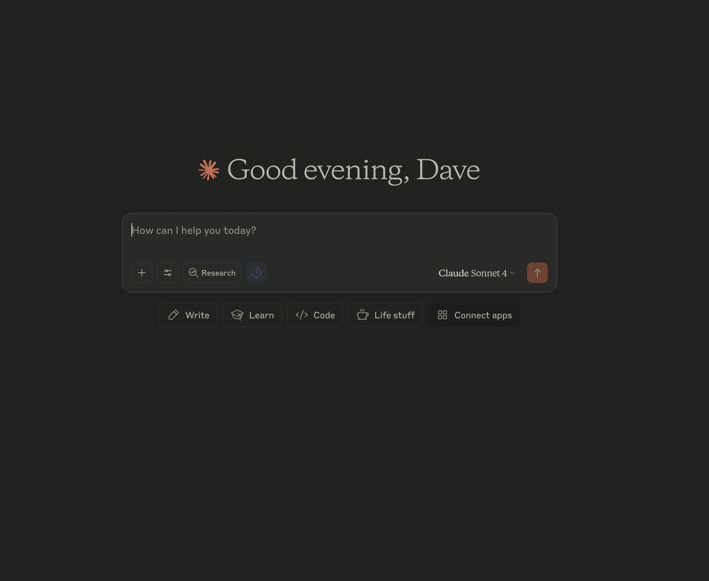
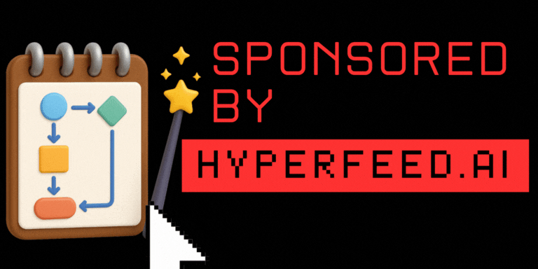

# 🎯 Vibe Marketing MCP
[](https://github.com/synthetic-ci/vibe-marketing)
[](https://smithery.ai/server/@synthetic-ci/vibe-marketing)
<!-- ALL-CONTRIBUTORS-BADGE:START - Do not remove or modify this section -->
[](#contributors-)
<!-- ALL-CONTRIBUTORS-BADGE:END -->





This Vibe Marketing MCP server is a fully open source compilation of the best Hooks, Copywriting Frameworks, and Influencer Archetypes for marketing and social media content creation.
Use this server with the most popular AI Clients like [Claude](https://claude.ai), [Claude Code](https://www.anthropic.com/claude-code), [Gemini CLI](https://github.com/google-gemini/gemini-cli), [Cursor](https://www.cursor.com) and many more!

## 🔗 Installation

You can easily install this server from smithery.ai by navigating to the Vibe Marketing [server page](https://smithery.ai/server/@synthetic-ci/vibe-marketing) and following the Connect instructions for your client.

## Why use this server?

### 🤖 AI Content Sucks, But You Can Fix It!

AI is notoriously bad at writing content, but with the right prompts and tools you can make big improvements and humanize your content. Too often the best hooks, copywriting frameworks and humanization hacks are locked away by gatekeepers asking you to like, subscribe and retweet only to discover another paywall. This server is a single place that anyone can contribute so we can all benefit and grow together. We welcome pull requests and contributions from the community and have made it [very easy for anyone to contribute](/#contributing).

### 🔥 Live Updates

Unlike LLMs which have a training cut-off the information in this server is updated in real time. This means you can use this server to discover the latest trends in real time.
In addition to trends which are updated automatically, when new contributions are made to the server, you will be able to use the latest and greatest content in your AI client immediately! This means the latest hooks, copywriting frameworks and humanization hacks and more are always available to you and always up to date.

### 🎯 Platform Specific Content

Each social network has it's own unique style, tone and content formatting hacks that can get the most from your content.
Using this MCP server your AI client will get instant access to this information and will be able to adapt your content to each platform easily.

### 🚀 Supercharged Content Creation

Because this server integrates with the most popular AI clients, you can use it to supercharge your content creation without even thinking about it. 
Your AI client will use this server to improve your content by default and call tools by itself without you having to do anything! 

[](https://hyperfeed.ai)

## 📖 Usage Examples

### 🪝 Find Proven Hooks
Prompt:
> I want to write a post for [social network] about the latest marketing hack I discovered, what's a good hook for this?

Outcome:
- invokes the `find-hooks` tool
- Your AI client will find the best hook for the post and structure the post for you.

### 📝 Find Proven Copywriting Frameworks
Prompt:
> Please find the best copywriting framework for [social network] about the latest marketing hack I discovered:
> (Optionally: provide the specific framework if you have one in mind.)

Outcome:
- invokes the `list-copywriting-frameworks` tool
- Your AI client will find the best copywriting framework for the post and structure the post for you.

### 🎯 What's trending?
Prompt:
> What's trending on [social network]?

Outcome:
- invokes the `get-trending-content` tool
- (Please note: this is the one tool that requires a HyperFeed.ai account on to use, you can signup for a free account here: [HyperFeed.ai](https://hyperfeed.ai))
- Your AI Client will pull this into context so you can use it to structure your post based on topics that are already trending.

### 💁‍♀️ Humanize Your Content
Prompt:
> Please humanize this content

Outcome:
- invokes the `flag-problematic-phrases` tool
- Your AI Client will flag potentially problematic phrases in the content for you and follow the latest best practices and guidelines for your social network.

### 🪄 Optimize Your Content
Prompt:
> Please validate the content before the fold for [social network]

Outcome:
- invokes the `validate-content-before-fold` tool
- Your AI Client will use the tool to validate that the content will be formatted correctly to the before the fold character limit for the social network.
- If this is a long post then the tool will have the correct rules for optimizing the content for the before the fold character limit.

## ✨ All Features

### 🔍 Social Media Hook Discovery
- **Find hooks by network**: Get platform-specific hooks for Twitter, Instagram, LinkedIn, TikTok, YouTube, and Facebook
- **Category-based search**: Find hooks by engagement type (educational, promotional, storytelling, etc.)

### 📝 Copywriting Frameworks
- **Platform-specific frameworks**: Tailored copywriting templates for each social media platform
- **Multiple frameworks per platform**: Choose from various proven copywriting structures

### 🎭 KOL Archetypes
- **12+ KOL archetypes**: From "The Hero" to "The Sage" - give your content some flair based on the archetype you choose.
- **Detailed descriptions**: Comprehensive archetype profiles with characteristics and messaging guidelines

### 🚫 Content Validation
- **Problematic phrase detection**: Automatically flag potentially problematic language
- **Above-the-fold optimization**: Validate and optimize your opening content
- **Content length management**: Get properly truncated text that maintains impact

### 📈 Trending Content Discovery
- **Real-time trends**: Access trending topics and content ideas
- **Platform-specific trends**: Get trends tailored to specific social media networks
- **Content inspiration**: Generate ideas based on what's currently popular

## 🛠️ Available Tools

### Hook Discovery
- `find-hooks` - Search for social media hooks by network and category
- `get-network-categories-for-hooks` - Get available hook categories for specific networks

### Copywriting
- `list-copywriting-frameworks-for-network` - List available frameworks for a platform
- `get-copywriting-framework` - Get detailed copywriting framework template

### Brand Management  
- `list-archetypes` - List all available brand archetypes
- `get-archetype` - Get detailed information about a specific archetype

### Content Validation
- `flag-problematic-phrases` - Detect potentially problematic language in content
- `validate-content-before-fold` - Validate above-the-fold content effectiveness
- `get-text-before-fold` - Get optimally truncated content for previews

### Trending Content
- `get-trending-content` - Access current trending topics and content ideas

## 📚 Resources

The MCP server provides access to curated resources:

- **Social Media Hooks**: Database of proven hooks categorized by platform and engagement type
- **Phrases to Avoid**: List of potentially problematic phrases to avoid in marketing content

## 🎯 Supported Platforms

- **Twitter/X** - Optimized for short-form, viral content
- **Instagram** - Visual-first content with engaging captions  
- **LinkedIn** - Professional, business-focused content
- **TikTok** - Trend-driven, entertainment-focused content
- **YouTube** - Long-form, educational content optimization
- **Facebook** - Community-building and engagement-focused content

# Contributing Dev Updates

### Prerequisites
- Node.js 20+  
- pnpm package manager
- Docker for testing before deployment

### Installation

1. **Clone the repository**
   ```bash
   git clone https://github.com/<your-username>/vibe-marketing-mcp.git
   cd vibe-marketing-mcp
   ```

2. **Install dependencies**
   ```bash
   npm install
   ```

3. **Development**
   ```bash
   # Start development server
   npm run dev
   ```

## 🧪 Testing

Run the comprehensive test suite:

```bash
# Run all tests
npm run test
```

## 🛡️ Code Quality

This project uses Biome for linting and formatting:

```bash
# Lint code
npm run lint

# Fix linting issues
npm run lint:fix
```

## Contributing

### Content Updates

Content is stored in the `src/content` directory.
You can easily update this content directly on Github by navigating to the file you want to update and clicking the edit button.
You can then make your changes and submit a pull request.
We will review the changes and merge them into the main branch.
Once the changes are merged, you (and everyone else) will be able benefit from your contributions!

- Copywriting Frameworks: https://github.com/synthetic-ci/vibe-marketing/tree/main/src/content/copywriting
- Social Media Hooks: https://github.com/synthetic-ci/vibe-marketing/blob/main/src/content/hooks/social-media-hooks.yml
- List of Phrases to Avoid: https://github.com/synthetic-ci/vibe-marketing/blob/main/src/content/humanizing/doNotuse.yml
- KOL Archetypes: https://github.com/synthetic-ci/vibe-marketing/blob/main/src/content/voicing/archetypes.yml

### Dev Updates

1. Fork the repository
2. Create your feature branch (`git checkout -b feature/amazing-feature`)
3. Make your changes
4. Run tests (`npm run test`)
5. Commit your changes (`git commit -m 'Add amazing feature'`)
6. Push to the branch (`git push origin feature/amazing-feature`)
7. Open a Pull Request!

## 📄 License

This project is licensed under the MIT License - see the [LICENSE](LICENSE) file for details.

## 🔗 Related Projects

- [Model Context Protocol](https://github.com/modelcontextprotocol) - The protocol this server implements

## 📧 Support

If you have questions or need help:

1. Check the [Issues](https://github.com/synthetic-ci/vibe-marketing/issues) page
2. Create a new issue if your question isn't answered
3. For urgent matters, reach out to the maintainers at [dav@hyperfeed.ai](mailto:dav@hyperfeed.ai)

---

**Built with ❤️ for creators, by [HyperFeed.ai](https://hyperfeed.ai)**

## Contributors ✨

Thanks goes to these wonderful people ([emoji key](https://allcontributors.org/docs/en/emoji-key)):

<!-- ALL-CONTRIBUTORS-LIST:START - Do not remove or modify this section -->
<!-- prettier-ignore-start -->
<!-- markdownlint-disable -->
<table>
  <tbody>
    <tr>
      <td align="center" valign="top" width="14.28%"><a href="https://davescommute.blog/"><br /><sub><b>David Norman</b></sub></a><br /><a href="https://github.com/normand1/Vibe Marketing MCP/commits?author=normand1" title="Code">💻</a></td>
    </tr>
  </tbody>
  <tfoot>
    <tr>
      <td align="center" size="13px" colspan="7">
        
          <a href="https://all-contributors.js.org/docs/en/bot/usage">Add your contributions</a>
        </img>
      </td>
    </tr>
  </tfoot>
</table>

<!-- markdownlint-restore -->
<!-- prettier-ignore-end -->

<!-- ALL-CONTRIBUTORS-LIST:END -->

This project follows the [all-contributors](https://github.com/all-contributors/all-contributors) specification. Contributions of any kind welcome!
